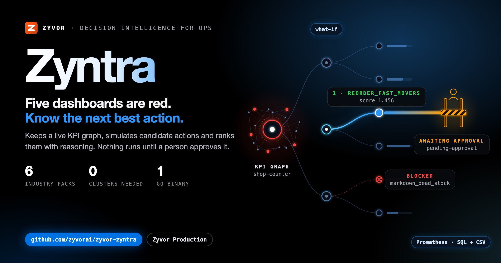

<div align="center">


# Zyntra

[](https://github.com/zyvorai/zyntra/actions/workflows/ci.yml)
[](LICENSE)
[](https://github.com/zyvorai/zyntra/releases)
[](go.mod)
[](https://zyvorai.github.io/zyntra/)

[](https://zyvor.dev/schedule?utm_source=github&utm_medium=zyntra&utm_campaign=readme_hero)
[](https://zyvor.dev/poc?utm_source=github&utm_medium=zyntra&utm_campaign=readme_hero)
[](#quickstart)

**[Docs site](https://zyvorai.github.io/zyntra/)** · [Quickstart](#quickstart) · [Reference](docs/REFERENCE.md) · [Product tour](https://zyvorai.github.io/zyntra/gallery) · [zyvor.dev](https://zyvor.dev/zyntra?utm_source=github&utm_medium=zyntra&utm_campaign=readme_hero)



## Five dashboards are red. Know the next best action, and why.

**Decision intelligence for operations.** Zyntra keeps a live graph of the KPIs you are judged on, shows which ones miss target and by how much, simulates every candidate action and ranks them. Nothing runs until a named person approves it, and every result is checked against the prediction.

Read-only sources · Explainable what-if · Human approval on every change · Dry-run by default · Signed decision records · One Go binary

</div>

---

| **One ranked answer.** | **See it before it runs.** | **A person decides.** | **Proof you can hand over.** |
|---|---|---|---|
| Gaps sorted worst first by criticality, and every candidate action ranked on its pessimistic case, with the reason. | A what-if through your KPI graph shows the predicted change to every KPI, with a range and the full path behind each number. | Roles, quorum and change windows. The prediction is re-checked right before anything runs, and dry-run is the default. | Every decision is a signed, hash-chained record that verifies offline, with predicted against actual per KPI. |

It runs on the data you already have (CSV exports, Prometheus, SQL, REST APIs, Kubernetes and webhooks) and works for any business that can export a CSV.

## Everything between a missed target and a verified fix. In one console.

Real console pages from the lab model and the manufacturing pack. No mock-ups.

### Stop arguing over dashboards. Start from a ranked plan.

Zyntra measures how far each KPI misses target, weights the gap by criticality, and ranks single actions and pairs by what they close, minus risk and stale inputs. A plan that only wins if every edge holds is flagged and ranked lower; a pair is kept only when it beats both actions alone; blocked actions say why.


### See what a change will do to every KPI, before you make it.

Simulate one action or several through the dependency graph: before, after, range and target for each KPI, with the arithmetic behind every number. Deterministic, with hard constraints and invariants checked at the pessimistic end.


### See the orders, services and machines behind a failing number.

A [business ontology](docs/ONTOLOGY.md) links your objects to the KPIs that measure them, with the source and time behind every fact. Connectors for files, HTTP, Kubernetes, SQL and REST; uncertain matches wait for a person; every read is permission-aware.


### Compare plans side by side, then pick one together.

Save a what-if with its assumptions, re-run it against current data and compare it with the alternatives. Running a scenario never changes anything.


### Runs on the data you already have. Read-only.

A dead source shows up as stale or down instead of quietly wrong. [KPI watches](docs/WATCHES.md) open an incident only when a breach is sustained, with acknowledgements and measured recovery, and [investigations](docs/INVESTIGATIONS.md) show sustained shifts and the changes that moved before them.


### Nothing runs until a person says so.

The approval lane shows the baseline against the prediction and the exact change that will run, with roles, quorum and change windows from your policy.


<details>
<summary>More pages: Overview, Workflows, Model</summary>

| | |
|---|---|
|  |  |
| **Overview.** What is off target, and what to do first. | **Workflows.** The orders a failing KPI puts at risk. |
|  | |
| **Model.** Targets, owners and declared edges, in YAML you own. | |

</details>

## The decision loop


1. **Sense.** Read-only sources refresh the KPI graph; each reports healthy, stale, fallback or down.
2. **Find the gap.** KPIs off target, weighted by criticality, worst first.
3. **Simulate.** Candidate actions propagate through declared edges with low/nominal/high bands.
4. **Rank.** Scored on the pessimistic case, minus risk and stale inputs; constraint breaches are blocked.
5. **Approve.** A named person (or a quorum) approves inside the action's change window.
6. **Revalidate.** Right before running, a fresh snapshot is re-simulated; stale inputs, drift or a changed model block it.
7. **Act.** Kubernetes, webhook or file action, dry-run by default, or sandboxed through Fabric Keep.
8. **Verify.** Predicted against actual per KPI; a regression opens a rollback proposal through the same approvals.

## From a red dashboard to a decision you can defend

| Use case | What Zyntra does |
|---|---|
| **End the war room** | When several KPIs go red at once, everyone starts from the same ranked plan and the reasoning behind it. |
| **Run GPU capacity** | Weigh Gryvia priority, GPU sharing and job suspend against queue and latency, with Netra network signals in the graph. |
| **Start from a CSV** | Point a retail, manufacturing, logistics, payments or imaging operations pack at an export and get a ranked plan. |
| **Investigate a KPI change** | Find sustained shifts and changes that moved before them, with downloadable evidence. Leads, not root causes. |
| **Answer from your runbooks** | Ask questions over your SOPs and policies and get [cited excerpts](docs/KNOWLEDGE.md), filtered by who is allowed to read them. |
| **Let scripts propose, not approve** | Service tokens let agents and scripts propose a change. A named person still approves every one. |

## Your dashboards show the problem. Zyntra decides the fix.

| | Typical dashboard and alerting tool | **Zyntra** |
|---|---|---|
| The question it answers | What the metrics look like now and over time | Which action closes the gap, and what it does to every other KPI |
| The model | Panels and queries | A KPI graph with targets, owners and declared cause-and-effect edges |
| What-if | Not part of a dashboard | Candidate actions simulated with ranges, then ranked |
| Taking action | Outside the tool, in runbooks and other systems | An approval lane with roles, quorum and change windows, dry-run by default |
| After the change | Someone watches the panels | Predicted against actual per KPI, and a rollback proposal on regression |
| Evidence | Dashboards and annotations | A hash-chained audit trail and signed decision records |

Dashboards are the right tool for visualising and alerting across many sources. Zyntra is not a replacement: it reads the same sources and turns what they show into a ranked, approved, verified decision.

<a id="quick-start"></a>

## Quickstart

```bash
git clone https://github.com/zyvorai/zyntra.git && cd zyntra
make build                                          # console (web/, Node 22) and the Go binary
./bin/zyntra plan -f packs/shop                     # a ranked plan from CSV fixtures, no cluster needed
ZYNTRA_API_KEY=dev ./bin/zyntra serve -f packs/shop # console and API on :8080
```

Sign in as `admin` / `Admin@321`. That account exists only while the policy file defines no users, and the console warns until you set `ZYNTRA_ADMIN_PASSWORD`.

| Industry | Pack | Try it |
|---|---|---|
| Retail | [`packs/shop`](packs/shop) | `./bin/zyntra plan -f packs/shop` |
| Manufacturing | [`packs/manufacturing`](packs/manufacturing) | `./bin/zyntra plan -f packs/manufacturing` |
| Logistics | [`packs/logistics`](packs/logistics) | `./bin/zyntra plan -f packs/logistics` |
| Payments | [`packs/payments`](packs/payments) | `./bin/zyntra plan -f packs/payments` |
| AI infrastructure | [`packs/gpu`](packs/gpu) | `./bin/zyntra plan -f packs/gpu` |
| Imaging operations | [`packs/imaging-ops`](packs/imaging-ops) | `./bin/zyntra plan -f packs/imaging-ops` |

A pack is a directory of files; a new industry is a new directory, not a project. `zyntra pack draft` drafts one from a sample export.

---

## For developers

### Install

```bash
# Container (multi-arch, cosign-signed, SBOM and provenance)
docker run --rm -p 8080:8080 -e ZYNTRA_API_KEY=dev ghcr.io/zyvorai/zyntra:edge

# Kubernetes
helm upgrade --install zyntra oci://ghcr.io/zyvorai/charts/zyntra -n zyntra --create-namespace --set pack=shop

# Compose: shop pack plus a test webhook receiver
ZYNTRA_API_KEY=$(openssl rand -hex 24) docker compose up --build
```

Binary under systemd, k3s without a registry, cosign verification and air-gapped installs: [Deploy](docs/REFERENCE.md#deploy).

### Configure

| Variable | Purpose |
|---|---|
| `ZYNTRA_API_KEY` | Break-glass admin access key and Bearer token |
| `ZYNTRA_ADMIN_PASSWORD` | Replace the public default admin password |
| `ZYNTRA_POLICY` | Approval policy: quorum, distinct approvers, change windows, local users |
| `ZYNTRA_OIDC_ISSUER`, `_CLIENT_ID`, `_CLIENT_SECRET`, `_ROLE_MAP` | Single sign-on and group-to-role mapping |
| `ZYNTRA_EXECUTE` | `dry-run` (default) or `apply` |
| `ZYNTRA_STATE_DIR` | Decisions, history, audit chain and signing key |
| `ZYNTRA_AI_BASE_URL` / `_MODEL` | Optional OpenAI-compatible model on your network; never required |
| `ZYNTRA_NOTIFY_URL` | Optional Slack/Teams-compatible webhook when a proposal needs a decision |

Full list: [Configuration](docs/REFERENCE.md#configuration).

### Documentation

| Guide | Covers |
|---|---|
| [Reference](docs/REFERENCE.md) | The model file, sources, packs, console, approvals, policy, configuration, [CLI](docs/REFERENCE.md#cli) and [API](docs/REFERENCE.md#api) |
| [Business ontology](docs/ONTOLOGY.md) | Objects, links, connectors, scenarios, tenants, service tokens and rollouts |
| [KPI watch inbox](docs/WATCHES.md) | Sustained-threshold incidents, acknowledgements and measured recovery |
| [KPI investigations](docs/INVESTIGATIONS.md) | Sustained shifts, lagged change associations and their limits |
| [Analytics foundation](docs/ANALYTICS.md) · [queries](docs/ANALYTICS_QUERIES.md) | Durable KPI history, robust anomalies, seasonal projections, backtests and scoped queries |
| [Document knowledge](docs/KNOWLEDGE.md) | Versioned, permission-aware documents and cited answers in Ask |
| [Product plan](docs/PRODUCT_PLAN.md) | Roadmap: what is planned, not what is shipped |

### Built to be trusted

- **No model decides.** The AI layer explains and forecasts. It never picks, ranks or runs an action, and nothing needs a model.
- **Read-only sources.** Zyntra reads your systems and never writes to them; actions hand the approved change to the system that owns it.
- **Honest about what it is.** The simulator is a deterministic model over the weights you declare, not a measurement. The newer packs carry declared starting weights; `zyntra calibrate` backtests them against real outcomes and only suggests corrections. [What to know before you rely on it](docs/REFERENCE.md#what-to-know-before-you-rely-on-it).

### Develop

```bash
make check      # gofmt, vet, unit tests, build
make test-e2e   # CLI + API + console smoke test against fake sources
cd web && ZYNTRA_DEV_API=http://127.0.0.1:8080 npm run dev   # console with hot reload
```

The docs site lives in [`website/`](website) (`npm --prefix website start`) and deploys to GitHub Pages on push to `main`.

### Part of the Zyvor stack

Zyntra is the decision layer of the Zyvor suite. Outside Zyvor it needs nothing but files. **[Netra](https://github.com/zyvorai/zyvor-netra)** supplies eBPF network signals, **[Gryvia](https://github.com/zyvorai/zyvor-gryvia)** GPU utilisation and the priority, MIG-sharing and job-suspend actions, and **[Fabric Keep](https://github.com/zyvorai/zyvorai-fabric)** sandboxed, audited execution of approved actions.

## Editions and license


| Edition | Capacity | Support |
|---|---|---|
| Community | Unlimited non-production clusters | Community |
| Enterprise Essentials | 2 clusters · 5 KPI graphs | 8×5, next business day |
| **Enterprise** | **10 clusters · 25 KPI graphs** | **24×7, P1 in 1 hour** |
| Enterprise Scale | 40 clusters · 100 KPI graphs | 24×7, P1 in 30 minutes, TAM |
| Sovereign / MSP | Custom | Mission-critical |

Zyntra is source-available under the **[Zyvor Production License v1.0](LICENSE)**. Every capability is in every edition and free for development, testing, evaluation, research, education and non-production labs. Production use (customer workloads, SaaS, managed services, OEM, redistribution) needs a commercial license, priced by managed clusters and KPI graphs, with unlimited users and approvers: [pricing detail](docs/sales/enterprise-pricing.md) · [Pricing](https://zyvor.dev/pricing?utm_source=github&utm_medium=zyntra&utm_campaign=readme_license) · [sales@zyvor.dev](mailto:sales@zyvor.dev).

**Security:** report vulnerabilities privately per [SECURITY.md](SECURITY.md). **Contributing:** see [CONTRIBUTING.md](CONTRIBUTING.md). Released versions are on the [releases page](https://github.com/zyvorai/zyntra/releases); anything newer on `main` is unreleased.

---

<div align="center">

### Know the next best action before the next war room

[](https://zyvor.dev/schedule?utm_source=github&utm_medium=zyntra&utm_campaign=readme_footer)
[](https://zyvor.dev/poc?utm_source=github&utm_medium=zyntra&utm_campaign=readme_footer)
[](https://zyvor.dev/pricing?utm_source=github&utm_medium=zyntra&utm_campaign=readme_footer)
[](mailto:sales@zyvor.dev?subject=Zyntra)
[](https://github.com/zyvorai/zyntra)

</div>
