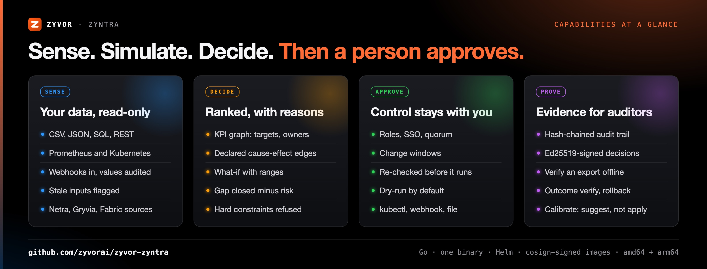

<div align="center">


# Zyntra

### Stop arguing over dashboards. Know the next best action — and why.

**Decision intelligence for operations.** Live signals in. A ranked, explained plan out.<br>
Nothing runs until a person approves it.

[](https://zyvor.dev/schedule?utm_source=github&utm_medium=zyntra&utm_campaign=readme_hero)
[](https://zyvor.dev/poc?utm_source=github&utm_medium=zyntra&utm_campaign=readme_hero)

[](https://github.com/zyvorai/zyvor-zyntra/actions/workflows/ci.yml)
[](LICENSE)
[](https://github.com/zyvorai/zyvor-zyntra/releases)


</div>

Five dashboards are red and nobody agrees what matters. Zyntra keeps a live graph of the KPIs your business is judged on, shows which ones miss target and by how much, simulates candidate actions through the dependency graph, and ranks them. Every recommendation comes with its reasoning, and every change waits for a named human.

It runs on the data you already have: CSV exports, Prometheus, SQL, REST APIs, Kubernetes and webhooks. It started in infrastructure operations and works for any business that can export a CSV.

## Why teams buy it

| | |
|---|---|
| **Decide with evidence** | Every number traces to an input, an edge or an action effect. The what-if shows the predicted change to every KPI, with a range and the full path it took. No model guesses. |
| **Every change approved and on the record** | Roles, quorum and change windows. The prediction is re-checked right before anything runs, dry-run is the default, and each decision is a signed, hash-chained record you can hand an auditor. |
| **Start from what you have** | A pack is a directory of files, so a new industry is not a project. Point it at a CSV export and get a ranked plan from the command line, with no cluster and nothing else to install. |

## How it works


## What is inside



| | |
|---|---|
| [](docs/REFERENCE.md#business-ontology) | [](docs/REFERENCE.md#packs-any-industry) |
| **Business ontology.** Orders, lines, machines and customers linked once, with the source of every fact. | **Packs.** Six industries ship in the box; a seventh is a directory. |
| [](docs/REFERENCE.md#approvals-and-execution) | [](docs/ONTOLOGY.md) |
| **Safety model.** Propose, approve, revalidate, execute, verify, roll back. | **Tenants, service tokens and rollouts.** Share the engine, not the data. |

## See it

Real console pages from the lab model and the manufacturing pack. No mock-ups.

| | |
|---|---|
|  |  |
| **Overview.** What is off target, and what to do first. | **Plan.** Every action ranked, with the reasoning. |
|  |  |
| **Simulate.** See the change before it happens. | **Approvals.** Nothing runs until a person says so. |
|  |  |
| **Objects.** What depends on what, with provenance. | **Scenarios.** Compare plans side by side. |

<details>
<summary>More pages: Workflows, Signals, Model</summary>

| | |
|---|---|
|  |  |
| **Workflows.** The orders a failing KPI puts at risk. | **Signals.** Live sources, trend and target status. |
|  | |
| **Model.** Targets, owners and declared edges. | |

</details>

## Packs for your industry


| Industry | Pack | Try it |
|---|---|---|
| Retail | [`packs/shop`](packs/shop) | `./bin/zyntra plan -f packs/shop` |
| Manufacturing | [`packs/manufacturing`](packs/manufacturing) | `./bin/zyntra plan -f packs/manufacturing` |
| Logistics | [`packs/logistics`](packs/logistics) | `./bin/zyntra plan -f packs/logistics` |
| Payments | [`packs/payments`](packs/payments) | `./bin/zyntra plan -f packs/payments` |
| AI infrastructure | [`packs/gpu`](packs/gpu) | `./bin/zyntra plan -f packs/gpu` |
| Imaging operations | [`packs/imaging-ops`](packs/imaging-ops) | `./bin/zyntra plan -f packs/imaging-ops` |

## Built to be trusted

- **No model decides.** The AI layer explains and forecasts. It never picks or runs an action.
- **A human approves every change,** with roles, quorum and change windows from your policy.
- **Dry-run by default.** A kubectl action is validated by the API server, and a webhook or file is rendered and shown, before anything is sent.
- **Read-only sources.** Zyntra reads your systems and never writes to them.
- **Signed, hash-chained records.** Edits and deletions are detectable, and a decision export verifies offline.
- **Honest about what it is.** The simulator is a model over the weights you declare. `zyntra calibrate` backtests it against real outcomes and only suggests corrections. [Details](docs/REFERENCE.md#what-to-know-before-you-rely-on-it).

## Quick start

```bash
make build                                   # console (web/, Node 22) and the Go binary
./bin/zyntra plan -f packs/shop              # a ranked plan from CSV fixtures, no cluster needed
ZYNTRA_API_KEY=dev ./bin/zyntra serve -f packs/shop   # console and API on :8080
```

Sign in as `admin` / `Admin@321`. That account exists only while the policy file defines no users, and the console warns until you set `ZYNTRA_ADMIN_PASSWORD`.

**Container**

```bash
docker run --rm -p 8080:8080 -e ZYNTRA_API_KEY=dev ghcr.io/zyvorai/zyntra:edge
```

**Kubernetes**

```bash
helm upgrade --install zyntra oci://ghcr.io/zyvorai/charts/zyntra -n zyntra --create-namespace --set pack=shop
```

Images are multi-arch (amd64 and arm64) and cosign-signed, with an SBOM and provenance. More on [deployment](docs/REFERENCE.md#deploy): binary under systemd, Compose, Helm values and k3s.


## Editions


| Edition | Capacity | Support |
|---|---|---|
| Community | Unlimited non-production clusters | Community |
| Enterprise Essentials | 2 clusters · 5 KPI graphs | 8×5, next business day |
| **Enterprise** | **10 clusters · 25 KPI graphs** | **24×7, P1 in 1 hour** |
| Enterprise Scale | 40 clusters · 100 KPI graphs | 24×7, P1 in 30 minutes, TAM |
| Sovereign / MSP | Custom | Mission-critical |

Every capability in this repository is in every edition and is free for non-production use. Production use needs a commercial licence, priced by managed clusters and KPI graphs, with unlimited users and approvers. [Talk to sales](mailto:sales@zyvor.dev) or [book a demo](https://zyvor.dev/schedule?utm_source=github&utm_medium=zyntra&utm_campaign=readme_editions).

## Where it fits in Zyvor

Zyntra is the decision layer of the Zyvor suite. Outside Zyvor it needs nothing but files.

| Product | What it gives Zyntra |
|---|---|
| **Netra** | eBPF network signals: retransmits, drops, latency, datapath health |
| **Gryvia** | GPU utilisation, queue and cost, and the priority, MIG-sharing and job-suspend actions |
| **Fabric Keep** | Sandboxed, audited execution of approved actions |

Generic sources read exports and APIs, and webhook or file actions hand the approved change to the system that already owns it: ERP, POS, ticketing.

## Documentation

- [Reference](docs/REFERENCE.md): the model file, sources, packs, console, approvals, policy, configuration, CLI, API and deployment
- [Business ontology](docs/ONTOLOGY.md): objects, links, scenarios, tenants and rollouts
- [Product plan](docs/PRODUCT_PLAN.md) · [Security](SECURITY.md) · [Contributing](CONTRIBUTING.md)
- [Social and README images](docs/social/README.md): how they are rebuilt from HTML

## License

Licensed under the **[Zyvor Production License v1.0](LICENSE)**.

- **Free** for development, testing, evaluation, research, education and non-production labs
- **Paid commercial license required** for production, customer workloads, SaaS, managed services, OEM, redistribution and other revenue-generating use

Commercial terms are issued separately at [zyvor.dev](https://zyvor.dev?utm_source=github&utm_medium=zyntra&utm_campaign=readme_footer).

**Next step:** [Book a demo](https://zyvor.dev/schedule?utm_source=github&utm_medium=zyntra&utm_campaign=readme_footer) · [30-day PoC](https://zyvor.dev/poc?utm_source=github&utm_medium=zyntra&utm_campaign=readme_footer) · [sales@zyvor.dev](mailto:sales@zyvor.dev)
