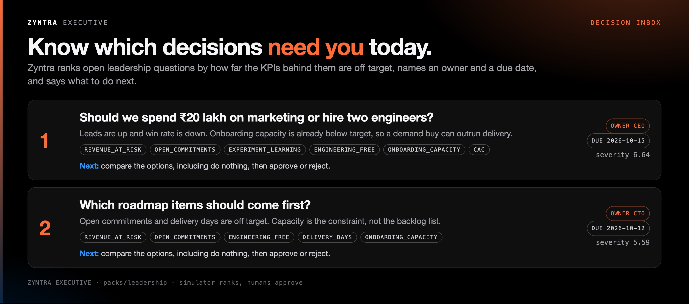
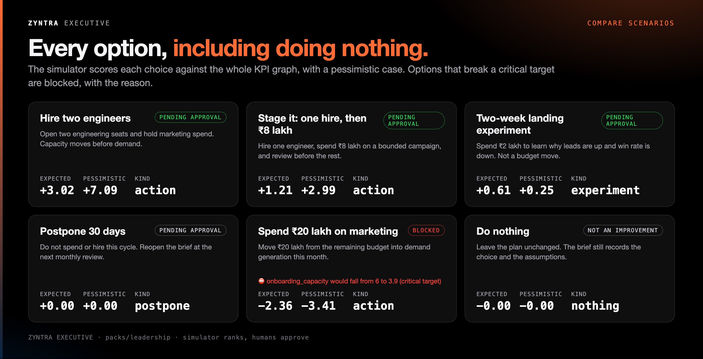
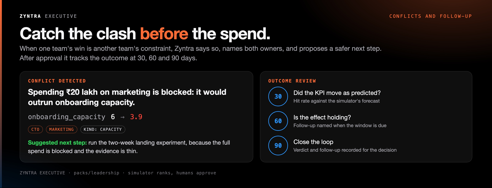

# Zyntra Executive

Leadership view over the decision loop. It does not rank, pick, or run an action. Every number comes from a KPI, an edge, an effect, or a recorded outcome.

Open it from the console at `#/executive`, or read it from the API:

| Method | Path | What it returns |
| --- | --- | --- |
| GET | `/api/v1/executive/inbox?audience=ceo` | Decisions that need this audience, with owner, deadline, and next step |
| GET | `/api/v1/executive/brief?decision=spend-or-hire` | Evidence, options including postpone and do nothing, uncertainty, next step |
| GET | `/api/v1/executive/conflicts` | Opposing plans and capacity constraints across owners |
| GET | `/api/v1/executive/reviews` | 30, 60, and 90 day follow-ups on recorded decisions |
| GET | `/api/v1/executive/digest?audience=leadership` | Grounded weekly note. It quotes the inbox. |
| GET | `/api/v1/executive/sensitivity?action=hire_two_engineers` | What happens when each named assumption is turned off |

`audience` is `ceo`, `cto`, `marketing`, or `leadership`.

The leadership pack (`packs/leadership`) is the first release: a B2B weekly review, including the ₹20 lakh question. `spend_20l_marketing` is blocked while it would worsen onboarding capacity. Hiring and a staged alternative stay ranked. An experiment is a separate low-risk action.

`executive.yaml` next to the pack names the questions and the assumptions. The server loads it from the pack directory (`-f packs/leadership`). Without that file the inbox is still built from gaps and the plan.

Approval stays closed when a required input is stale. Forecast accuracy comes from the existing outcome record, not from a model.

## Overview cards

Figures come from `packs/leadership`. Regenerate with `./docs/ux/build-readme-cards.sh`.
